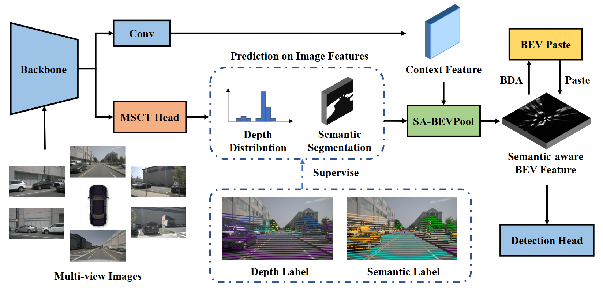

<div align="center">
<h1>SA-BEV</h1>
<h3>[ICCV2023] SA-BEV: Generating Semantic-Aware Bird's-Eye-View Feature for Multi-view 3D Object Detection</h3>
</div>


<div align="center">
  
</div><br/>

## News

- **2023.07.14** SA-BEV is accepted by ICCV 2023. The paper is available [here](https://arxiv.org/abs/2307.11477).

## Main Results

| Config                                                          | mAP   | NDS  | Baidu | Google |
| --------------------------------------------------------------- | :----: | :----: | :-----: | :---: |
| [**SA-BEV-R50**](configs/sabev/sabev-r50.py)                    | 35.5  | 46.7 | [link](https://pan.baidu.com/s/1ue-Rr2rNU-s1DUs2jqpxcQ?pwd=oo8x) | [link](https://drive.google.com/drive/folders/1-scWXNni3xkPibv7CApS--a5JSDmujUu?usp=sharing) |
| [**SA-BEV-R50-MSCT**](configs/sabev/sabev-r50-msct.py)          | 37.0  | 48.8 | [link](https://pan.baidu.com/s/1ue-Rr2rNU-s1DUs2jqpxcQ?pwd=oo8x) | [link](https://drive.google.com/drive/folders/1-scWXNni3xkPibv7CApS--a5JSDmujUu?usp=sharing) |
| [**SA-BEV-R50-MSCT-CBGS**](configs/sabev/sabev-r50-msct-cbgs.py)| 38.7  | 51.2 | [link](https://pan.baidu.com/s/1ue-Rr2rNU-s1DUs2jqpxcQ?pwd=oo8x) | [link](https://drive.google.com/drive/folders/1-scWXNni3xkPibv7CApS--a5JSDmujUu?usp=sharing) |


## Get Started

#### 1. Please follow these steps to install SA-BEV.

a. Create a conda virtual environment and activate it.
```shell
conda create -n sabev python=3.8 -y
conda activate sabev
```

b. Install PyTorch and torchvision following the [official instructions](https://pytorch.org/).
```shell
pip install torch==1.10.0+cu111 torchvision==0.11.0+cu111 torchaudio==0.10.0 -f https://download.pytorch.org/whl/torch_stable.html
```

c. Install SA-BEV as mmdet3d.
```shell
pip install mmcv-full==1.5.3
pip install mmdet==2.27.0
pip install mmsegmentation==0.25.0
pip install -e .
```

#### 2. Prepare nuScenes dataset as introduced in [nuscenes_det.md](docs/en/datasets/nuscenes_det.md) and create the pkl for SA-BEV by running:

```shell
python tools/create_data_bevdet.py
```

#### 3. Download nuScenes-lidarseg from nuScenes official site and put it under data/nuscenes/. Create depth and semantic labels from point cloud by running:
```shell
python tools/generate_point_label.py
```

#### 4. Train and evalutate model following:
```shell
bash tools/dist_train.sh configs/sabev/sabev-r50.py 8 --no-validate
bash tools/dist_test.sh configs/sabev/sabev-r50.py work_dirs/sabev-r50/epoch_24_ema.pth 8 --eval bbox
```


## Acknowledgement

This project is not possible without multiple great open-sourced code bases. We list some notable examples below.

- [BEVDet](https://github.com/HuangJunJie2017/BEVDet)
- [BEVDepth](https://github.com/Megvii-BaseDetection/BEVDepth)
- [open-mmlab](https://github.com/open-mmlab)
- [CenterPoint](https://github.com/tianweiy/CenterPoint)
- [Lift-Splat-Shoot](https://github.com/nv-tlabs/lift-splat-shoot)
- [Multi-Task-Learning-PyTorch](https://github.com/SimonVandenhende/Multi-Task-Learning-PyTorch.git)

## Bibtex

If SA-BEV is helpful for your research, please consider citing the following BibTeX entry.
```
@article{zhang2023sabev,
  title={SA-BEV: Generating Semantic-Aware Bird's-Eye-View Feature for Multi-view 3D Object Detection},
  author={Jinqing, Zhang and Yanan, Zhang and Qingjie, Liu and Yunhong, Wang},
  journal={arXiv preprint arXiv:2307.11477},
  year={2023},
}
```

